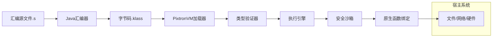
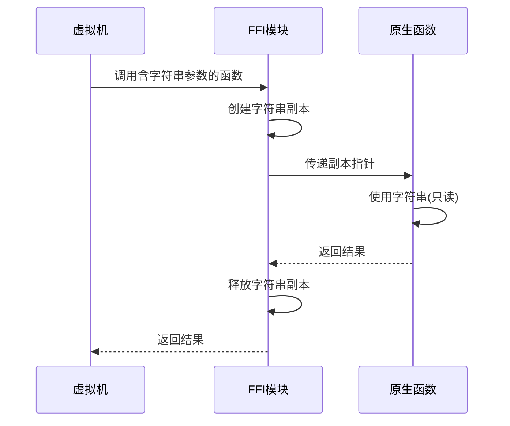
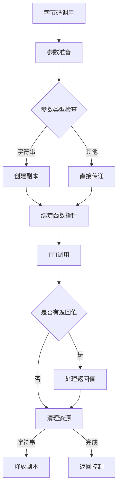
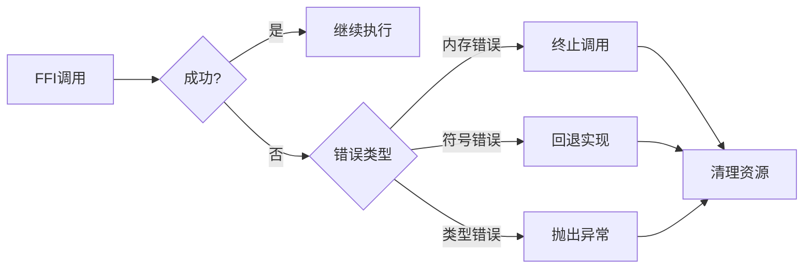

# PixtronVM - 轻量级类型安全栈式虚拟机

<div align="center">
    
    <p><em>高效、安全、轻量级的字节码执行引擎</em></p >
</div>

**PixtronVM** 是一款专为资源受限环境设计的静态类型栈式虚拟机，通过显式类型标注和优化的字节码执行，在嵌入式系统和边缘计算场景中提供安全高效的代码执行能力。基于C11标准构建，支持CMake
3.10+构建系统，确保广泛的平台兼容性。

## 设计哲学

- **类型安全为先**：静态类型系统在编译期和加载期进行类型验证
- **性能与资源平衡**：优化指令调度减少运行时开销
- **安全隔离**：内置沙箱机制确保执行环境隔离
- **可扩展性**：模块化架构支持自定义扩展
- **标准兼容**：基于C11和CMake 3.10构建，确保广泛兼容性

## 📂 项目结构

```bash
PixtronVM/
├── assembler/              # Java实现的字节码汇编器
│   ├── src/
│   │   ├── main/java/      # 汇编器核心代码
│   │   │   ├── conf/       # 配置和元数据结构
│   │   │   ├── lexer/      # 词法分析器
│   │   │   ├── parser/     # 语法分析器
│   │   │   └── util/       # 工具类
│   │   └── test/           # 汇编器单元测试
├── include/                # C头文件
│   ├── api/                # 公共API接口
│   ├── engine/             # 虚拟机核心头文件
├── lib/                    # 标准库实现
│   ├── Math.klass          # 数学库字节码
│   ├── System.c            # 系统原生函数
├── src/                    # C源文件
│   ├── VM.c                # 虚拟机主入口
│   ├── Engine.c            # 指令执行引擎
│   ├── Memory.c            # 内存管理
│   ├── FFI.c               # 外部函数接口
│   └── ...                 # 其他核心组件
├── tests/                  # C测试套件
├── example/                # 示例程序
├── CMakeLists.txt          # 主构建配置
└── config.h.in             # 配置模板
```

## ✨ 核心特性

### 🛡️ 类型安全架构

- 显式类型标注的字节码格式
- 加载期类型完整性验证
- 运行时类型安全检查
- 支持基础数据类型：`int8`/`int16`/`int32`/`int64`/`double`/`bool`/`string`

### ⚡ 性能优化

- 直接线程代码(DTC)执行引擎
- 零开销指令分派机制
- 寄存器式栈缓存优化
- 指令预取流水线

### 🔒 安全沙箱

- 内存访问边界检查
- 指令执行计数限制
- 隔离堆栈执行环境
- 系统调用拦截层

### 📦 轻量化设计

- 核心引擎 < 50KB (ARM Cortex-M)
- 无动态内存分配
- 单文件头文件集成

## 🚀 快速开始

Hello World示例
创建 TString.s 汇编文件：

```asm
@namespace TString

@import { println } from System

@constant "Hello, World!"  # 定义字符串常量

@func main(): void
    %locals 0    # 无局部变量
    %stack 1     # 操作数栈深度1
    
    ldc.str 0    # 加载常量索引0的字符串
    call println # 调用打印函数
    ret          # 返回
@end
```

编译并运行：

```bash
# 编译汇编文件
./you/build/path/assembler -o /you/klass/path/ TString.s

# 执行字节码
./build/bin/pixtronvm /you/klass/path TString

# 输出: Hello, World!
```

## 🧩 系统架构



## 📖 开发指南

# FFI（外部函数接口）集成指南

## 概述

虚拟机通过`@native`标注实现了字节码与本地原生函数的无缝集成，使用`libffi`自动处理函数调用。本指南详细说明了如何声明、使用和管理原生函数调用，特别强调
**字符串参数的自动内存管理**和**C ABI专属支持**。

---

## 快速入门

### 基本使用步骤

1. **声明原生函数**：使用`@native`标注
2. **实现原生函数**：在C语言中实现并导出
3. **调用函数**：像普通字节码函数一样调用

### 示例代码

**字节码声明**:

```plaintext
@namespace System

; 控制台输出函数
@func @native println(string message) : void @end

@namespace Math
; 自动绑定到标准库函数
@func @native sqrt(double value) : double @end
```

**C语言实现**:

```c
#include <stdio.h>

extern void println(const char* message) {
    printf("%s\n", message);
}


#endif
```

**字节码调用**:

```plaintext
; 使用原生函数
; String literal define
@import { println  } from System
@import { sqrt     } from Math

@constant "Hello FFI!"

@func main(): void
    ldc.str 0
    call println
    load.f64 2.5
    call sqrt
@end
```

---

## 函数声明语法

### 基本结构

```plaintext
@func @native <function_name>(<param_type> <param_name>, ...) : <return_type> @end
```

### 关键规则

1. **`@native`标注**：必须存在且无函数体
2. **命名空间**：可以声明在任何命名空间中
3. **命名规范**：
    - 函数名必须与原生符号完全匹配

### 有效示例

```plaintext
; 无返回值函数
@func @native logError(string message) : void @end

; 多参数函数
@func @native add(int a, int b) : int @end
```

---

## 数据类型映射

| 字节码类型    | C语言类型         | FFI类型              | 传递方式     |
|----------|---------------|--------------------|----------|
| `int`    | `int32_t`     | `ffi_type_sint32`  | 值传递      |
| `long`   | `int64_t`     | `ffi_type_sint64`  | 值传递      |
| `double` | `double`      | `ffi_type_double`  | 值传递      |
| `string` | `const char*` | `ffi_type_pointer` | **指针传递** |
| `void`   | `void`        | `ffi_type_void`    | -        |
| `object` | `void*`       | `ffi_type_pointer` | 指针传递     |

> **不支持的类型**：结构体、联合体、数组、函数指针

---

## 字符串处理机制

### 生命周期管理



### 关键特性

1. **自动副本创建**：
    - 在调用前创建完整副本
    - 包含null终止符
    - 使用VM内存分配器

2**自动释放**：

- 函数返回后立即释放
- 按参数反序释放（LIFO）
- 使用相同内存分配器

3**编码规范**：

- 所有字符串使用UTF-8编码
- 最大长度：无限制
- 包含完整字节序列

### 内存操作伪代码

```c
// 创建副本
extern char *pvm_string_to_cstr(const String *str) {
    if (str == NULL || str->len == 0) {
        return NULL;
    }
    const uint32_t len = str->len + 1;
    char *c_str = pvm_mem_cpy(str->str, len);
    c_str[len] = '\0';
    return c_str;
}

// 释放副本
void release_copy(char* str) {
    pvm_mem_free(str);
}
```

---

## 调用过程详解

### 调用流程图



### 关键阶段

1. **准备阶段**：
    - 解析函数签名
    - 验证参数类型
    - 准备FFI cif结构

2. **执行阶段**：
    - 创建字符串副本
    - 绑定函数指针
    - 调用原生函数

3. **清理阶段**：
    - 释放字符串副本
    - 处理返回值
    - 异常处理

---

## 平台兼容性

### 符号导出要求

| 平台          | 导出宏                                      | 验证命令                           |
|-------------|------------------------------------------|--------------------------------|
| Windows     | `__declspec(dllexport)`                  | `dumpbin /EXPORTS program.exe` |
| Linux/macOS | `__attribute__((visibility("default")))` | `nm -D program                 | grep function` |

### C++兼容性处理

```c
// 必须避免C++名称修饰
#ifdef __cplusplus
extern "C" {
#endif

EXPORT void myFunction(const char* str);

#ifdef __cplusplus
}
#endif
```

### ABI严格限制

1. **仅支持标准C ABI**
2. **禁止使用以下调用约定**：
    - stdcall
    - fastcall
    - thiscall
3. **错误处理**：
    - 尝试调用非C ABI函数将抛出`FFI_ABI_MISMATCH`

---

## 最佳实践

### 函数设计原则

1. **无状态函数**：
   ```c
   // 推荐：纯函数
   double calculate(double a, double b);
   
   // 避免：有状态函数
   void initContext();
   void processData(Context* ctx);
   ```

2. **字符串处理**：
   ```c
   // 安全：使用长度参数
   void processBuffer(const char* data, size_t length);
   
   // 危险：依赖null终止符
   void processString(const char* str);
   ```

### 安全准则

1. 原生函数不应修改字符串内容
2. 不要缓存或返回字符串指针
3. 避免长时间持有字符串引用
4. 大文件使用缓冲区API而非字符串

---

## 性能优化

### 开销分析

| 操作   | 小字符串(<64B) | 中字符串(1KB) | 大字符串(1MB+) |
|------|------------|-----------|------------|
| 复制开销 | 低(~100ns)  | 中(~1μs)   | 高(>1ms)    |
| 内存开销 | 可忽略        | 中等        | 显著         |

### 处理流程



### 调试支持

```bash
# 启用详细日志
VM_FFI_DEBUG=2 ./program

# 日志示例
[FFI] Calling: Math::pow
  Param[0]: double = 2.000000
  Param[1]: double = 3.000000
  Return: double = 8.000000
```

## 📜 许可证

PixtronVM采用 **Apache License 2.0** 开源协议分发

```
Copyright 2023 PixtronVM Contributors

Licensed under the Apache License, Version 2.0 (the "License");
you may not use this file except in compliance with the License.
You may obtain a copy of the License at

   https://www.apache.org/licenses/LICENSE-2.0

Unless required by applicable law or agreed to in writing, software
distributed under the License is distributed on an "AS IS" BASIS,
WITHOUT WARRANTIES OR CONDITIONS OF ANY KIND, either express or implied.
See the License for the specific language governing permissions and
limitations under the License.
```