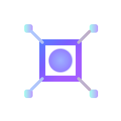

# PixtronVM - 轻量级类型安全栈式虚拟机

<div align="center">
    
    <p><em>高效、安全、轻量级的字节码执行引擎</em></p >
</div>

**PixtronVM** 是一款专为资源受限环境设计的静态类型栈式虚拟机，通过显式类型标注和优化的字节码执行，在嵌入式系统和边缘计算场景中提供安全高效的代码执行能力。基于C11标准构建，支持CMake
3.10+构建系统，确保广泛的平台兼容性。

## 设计哲学

- **类型安全为先**：静态类型系统在编译期和加载期进行类型验证
- **性能与资源平衡**：优化指令调度减少运行时开销
- **安全隔离**：内置沙箱机制确保执行环境隔离
- **可扩展性**：模块化架构支持自定义扩展
- **标准兼容**：基于C11和CMake 3.10构建，确保广泛兼容性

## 📂 项目结构

```bash
PixtronVM/
├── assembler/              # Java实现的字节码汇编器
│   ├── src/
│   │   ├── main/java/      # 汇编器核心代码
│   │   │   ├── conf/       # 配置和元数据结构
│   │   │   ├── lexer/      # 词法分析器
│   │   │   ├── parser/     # 语法分析器
│   │   │   └── util/       # 工具类
│   │   └── test/           # 汇编器单元测试
├── include/                # C头文件
│   ├── api/                # 公共API接口
│   ├── engine/             # 虚拟机核心头文件
├── lib/                    # 标准库实现
│   ├── Math.klass          # 数学库字节码
│   ├── System.c            # 系统原生函数
├── src/                    # C源文件
│   ├── VM.c                # 虚拟机主入口
│   ├── Engine.c            # 指令执行引擎
│   ├── Memory.c            # 内存管理
│   ├── FFI.c               # 外部函数接口
│   └── ...                 # 其他核心组件
├── tests/                  # C测试套件
├── example/                # 示例程序
├── CMakeLists.txt          # 主构建配置
└── config.h.in             # 配置模板
```

## ✨ 核心特性

### 🛡️ 类型安全架构

- 显式类型标注的字节码格式
- 加载期类型完整性验证
- 运行时类型安全检查
- 支持基础数据类型：`int8`/`int16`/`int32`/`int64`/`double`/`bool`/`string`

### ⚡ 性能优化

- 直接线程代码(DTC)执行引擎
- 零开销指令分派机制
- 寄存器式栈缓存优化
- 指令预取流水线

### 🔒 安全沙箱

- 内存访问边界检查
- 指令执行计数限制
- 隔离堆栈执行环境
- 系统调用拦截层

### 📦 轻量化设计

- 核心引擎 < 50KB (ARM Cortex-M)
- 无动态内存分配
- 单文件头文件集成

## 🚀 快速开始

Hello World示例
创建 TString.s 汇编文件：

```asm
@namespace TString

@import { println } from System

@constant "Hello, World!"  # 定义字符串常量

@func main(): void
    %locals 0    # 无局部变量
    %stack 1     # 操作数栈深度1
    
    ldc.str 0    # 加载常量索引0的字符串
    call println # 调用打印函数
    ret          # 返回
@end
```

编译并运行：

```bash
# 编译汇编文件
./you/build/path/assembler -o /you/klass/path/ TString.s

# 执行字节码
./build/bin/pixtronvm /you/klass/path TString

# 输出: Hello, World!
```

## 🧩 系统架构

```mermaid
graph LR
    A[汇编源文件.s] --> B[Java汇编器]
    B --> C[字节码.klass]
    C --> D[PixtronVM加载器]
    D --> E[类型验证器]
    E --> F[执行引擎]
    F --> G[安全沙箱]
    G --> H[原生函数绑定]
    H --> I[系统资源]

    subgraph 宿主系统
        I[文件/网络/硬件]
    end
```

## 📖 开发指南

FFI外部函数接口

基本操作类型

```c
// 基本FFI操作（无参数/返回值）
typedef void (*FFIBaseOperation)(RuntimeContext *context);

// 带返回值的FFI操作
typedef void (*FFIResultOperation)(RuntimeContext *context, FFIResult *result);
```

异常处理

```c
// 抛出格式化异常
void FFI_ThrowException(RuntimeContext *context, char *fmt, ...);

// 使用示例：
void native_divide(RuntimeContext *ctx, FFIResult *result) {
    double divisor = FFI_GetDoubleParam(ctx, 1);
    if (divisor == 0.0) {
        FFI_ThrowException(ctx, "Division by zero at PC: %d", ctx->pc);
        return;
    }
    double quotient = FFI_GetDoubleParam(ctx, 0) / divisor;
    FFI_SetDouble(result, quotient);
}
```

参数获取

```c
// 获取各种类型的参数
int8_t  FFI_GetByteParam(RuntimeContext *context, uint16_t index);
int16_t FFI_GetShortParam(RuntimeContext *context, uint16_t index);
int32_t FFI_GetIntParam(RuntimeContext *context, uint16_t index);
int64_t FFI_GetLongParam(RuntimeContext *context, uint16_t index);
double  FFI_GetDoubleParam(RuntimeContext *context, uint16_t index);
char*   FFI_GetStringParam(RuntimeContext *context, uint16_t index);
```
结果设置

```c
// 设置各种类型的返回值
void FFI_SetByte(FFIResult *result, int8_t value);
void FFI_SetShort(FFIResult *result, int16_t value);
void FFI_SetInt(FFIResult *result, int32_t value);
void FFI_SetLong(FFIResult *result, int64_t value);
void FFI_SetDouble(FFIResult *result, double value);
void FFI_SetBool(FFIResult *result, bool value);
```
完整FFI示例

Native 函数声明
```asm
@func @native("PixotronVM.so") println(string text):void @end
```
C 函数实现
```asm
void println(RuntimeContext *context) {
    const char *const str = FFI_GetStringParam(context, 0);
    if (str == NULL) {
        printf("%s\n", "null");
        return;
    }
    printf("%s\n", str);
}

```

## 📜 许可证

PixtronVM采用 **Apache License 2.0** 开源协议分发

```
Copyright 2023 PixtronVM Contributors

Licensed under the Apache License, Version 2.0 (the "License");
you may not use this file except in compliance with the License.
You may obtain a copy of the License at

   http://www.apache.org/licenses/LICENSE-2.0

Unless required by applicable law or agreed to in writing, software
distributed under the License is distributed on an "AS IS" BASIS,
WITHOUT WARRANTIES OR CONDITIONS OF ANY KIND, either express or implied.
See the License for the specific language governing permissions and
limitations under the License.
```